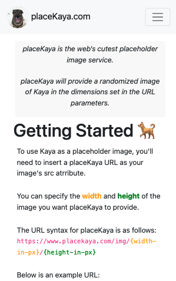

# placeKaya.com

## Summary

placeKaya is the web's cutest placeholder image service.

placeKaya will provide a randomized image of Kaya (a very good girl) in the dimensions set in the URL parameters.

## Getting Started

To use Kaya as a placeholder image, you need to insert a placeKaya URL as your image's src atrribute.

You can specify the width and height of the image you want placeKaya to serve to your site.

The URL syntax for placeKaya is as follows: 
```https://www.placekaya.com/img/{width-in-px}/{height-in-px}```

Below is an example URL:
```https://www.placekaya.com/img/900/600```

The numbers after the domain name and img segment in the URL (in this case, /900/600) specify the width and the height of the image. In this example, placeKaya would provide an image that is 900 pixels in width and 600 pixels in height.

## Screenshot



## About

This site and service was created by Jack Doran, as a tribute to the cuteness of my dog, Kaya. I will continue to develop this site, add additional pictures, and hopefully add more functionality for image transformation in the future.

I largely followed [this tutorial](https://spacejelly.dev/posts/how-to-create-an-image-placeholder-service-api-with-cloudinary-netlify-functions) to get started, and then customized as needed. This is a good resource if you are new to Netlify or Cloudinary. 

## Contact

You can contact me here on Github for issues with the site, or by email at jcdoran33@gmail.com

If you have used placeKaya in any of your projects, let me know! I would love to see it in action.

